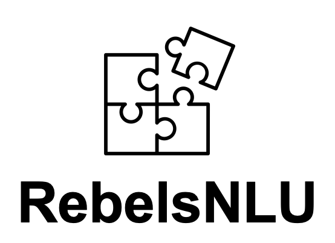

<link rel="stylesheet" type="text/css" href="css/style.css" />

  

Reading between the Lines
for Natural Language Understanding Lab

# Introduction

RebelsNLU is a research lab at <a href="https://www.jaist.ac.jp/english/">Japan Advanced Institute of Science and Technology</a>, run by <a href="https://naoya-i.github.io/">Associate Professor Naoya Inoue</a>.
We study how to create machines that can understand our human language.
Our ultimate goal is to equip machines with an ability to *infer something*--making implicit things explicit and reading between the lines.
Our main research field includes Artificial Intelligence (AI) and Natural Language Processing (NLP).

# News

- 2022/4/1: Born!
