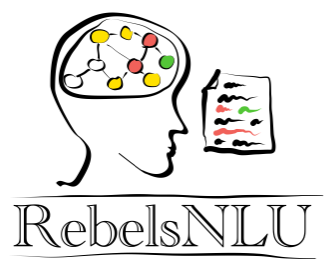

  

Reading between the Lines  
for Natural Language Understanding Lab  
(言語推論研究室)

Dear potential students: I'm hosting informal discussion hours for 展開配属 (本配属) at JAIST (appointment required). See [here](https://rebelsnlu-jaist.github.io/joinus.html) for more details.

# Introduction

RebelsNLU is a research lab for Artificial Intelligence (AI) and Natural Language Processing (NLP), run by <a href="https://naoya-i.github.io/">Associate Professor Naoya Inoue</a> at <a href="https://www.jaist.ac.jp/english/">Japan Advanced Institute of Science and Technology (JAIST)</a>.
We study how to create machines that can understand our human language.
Particularly, we are interested in reasoning skills for AI.
Our ultimate goal is to equip machines with an ability to *infer something*--making implicit things explicit and reading between the lines.

# News

- 2022/04/14: I'm hosting informal discussion hours for 展開配属 (本配属) at JAIST (appointment required). See [here](https://rebelsnlu-jaist.github.io/joinus.html) for more details.
- 2022/04/01: Born!
