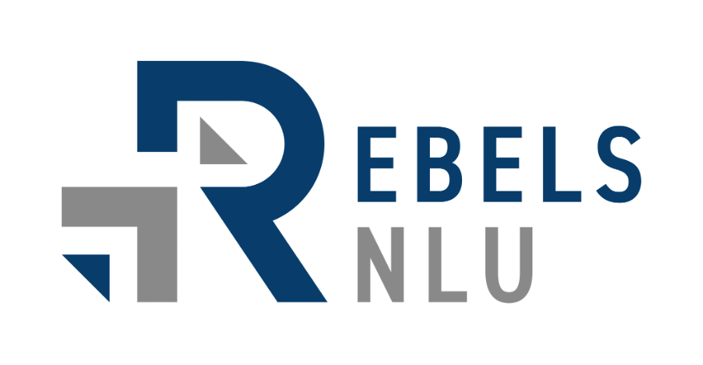

<!--  -->

**RebelsNLU** is an international research lab for Artificial Intelligence (AI) and Natural Language Processing (NLP), run by [Associate Professor Naoya Inoue](https://naoya-i.info/) at [Japan Advanced Institute of Science and Technology (JAIST)](https://www.jaist.ac.jp/english/) (since 2022). RebelsNLU is short for **Re**ading **be**tween the **L**ine**s** for **N**atural **L**anguage **U**nderstanding.

One important mission of a university research lab is to develop students’ skills. We design lab activities so that students can acquire general-purpose skills for problem-finding and problem-solving, let alone expertise in natural language processing research and its related areas.

Through the lab activities, students will learn how to think critically, how to plan, how to present their work, how to dive into unknown fields, how to program, and how to work as a team. Our motto is that research is the best “on-the-job (OJT) training” for developing such skills (the founder Prof. Inoue's favorite word learned from his old mentor).

## Activities
Our lab implements many types of student-driven activities:

- **Paper Skimming** (weekly): All lab members gather to discuss recent advancements in NLP research.
- **Poster** (monthly): Lab members present and discuss their research progress in depth.
- **Spotlight Oral** (on demand): Members share insights from relatively complete work, offering learning opportunities for everyone.
- **Project/Paper Meeting**: A dedicated time for students to share their projects and engage in intensive discussions about problems and potential solutions.
- **Study Groups** (on-demand): Recognizing that knowledge fuels healthy research, we learn together—covering topics such as NLP fundamentals, programming, sparse autoencoders, and any other subjects of interest.
- **Social Gathering** (on-demand): We celebrate various milestones and occasions—welcome parties, farewell parties, birthdays, year-end celebrations, New Year gatherings, and more.

On top of these activities, students actively discuss with lab members, come up with innovative ideas, program these ideas as a computational model, and evaluate these ideas quantitatively and qualitatively. After a number of trials, someday, students will obtain interesting insights. They then write and submit a paper to academic conferences to improve the idea, communicating with researchers worldwide.

To develop globally successful students, we use English, one of the most well-used languages in the world, as a common language in these activities.

<!-- ## Research Direction

We study how to create machines that can understand our human language. Particularly, we are interested in reasoning skills for AI. Our ultimate goal is to equip machines with an ability to infer something--making implicit things explicit and reading between the lines.

 -->

## Latest News

Latest updates are mirrored from our X/Twitter posts:

<!-- 

  <a href="https://twitter.com/rebelsnlu_jaist/status/1981252753004646446">X/Twitter update: 1981252753004646446</a>
  <a href="https://twitter.com/rebelsnlu_jaist/status/1934479054440456330">X/Twitter update: 1934479054440456330</a>
  <a href="https://twitter.com/rebelsnlu_jaist/status/1909451952100192476">X/Twitter update: 1909451952100192476</a>
  <a href="https://twitter.com/rebelsnlu_jaist/status/1909419444067282986">X/Twitter update: 1909419444067282986</a>
  <a href="https://twitter.com/rebelsnlu_jaist/status/1909419545078771860">X/Twitter update: 1909419545078771860</a>
  <a href="https://twitter.com/rebelsnlu_jaist/status/1884777519917990032">X/Twitter update: 1884777519917990032</a>
  <a href="https://twitter.com/rebelsnlu_jaist/status/1868459764570841396">X/Twitter update: 1868459764570841396</a>
  <a href="https://twitter.com/rebelsnlu_jaist/status/1852201332439929334">X/Twitter update: 1852201332439929334</a>
  <a href="https://twitter.com/rebelsnlu_jaist/status/1850818257164644404">X/Twitter update: 1850818257164644404</a>
  <a href="https://twitter.com/rebelsnlu_jaist/status/1847189787452887548">X/Twitter update: 1847189787452887548</a>

 -->

Older posts:

- [2024 posts](https://rebelsnlu.super.site/older-2024-posts)
- [2023 posts](https://rebelsnlu.super.site/older-2024-posts/2023-posts)
- [2022 posts](https://rebelsnlu.super.site/older-2024-posts/2023-posts/2022-posts)

## Quick Links

  <a href="/people.html">People</a>
  <a href="/projects.html">Projects</a>
  <a href="/publications.html">Publications</a>
  <a href="/joinus.html">Join us!</a>
  <a href="/contact.html">Contact</a>

