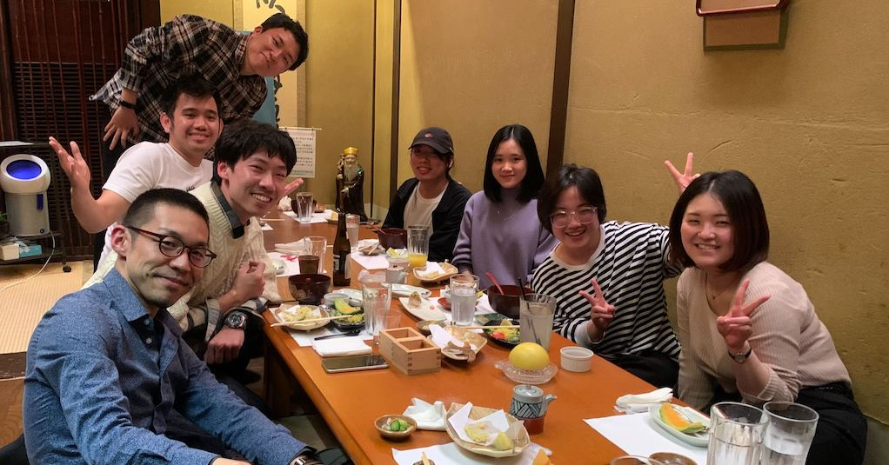
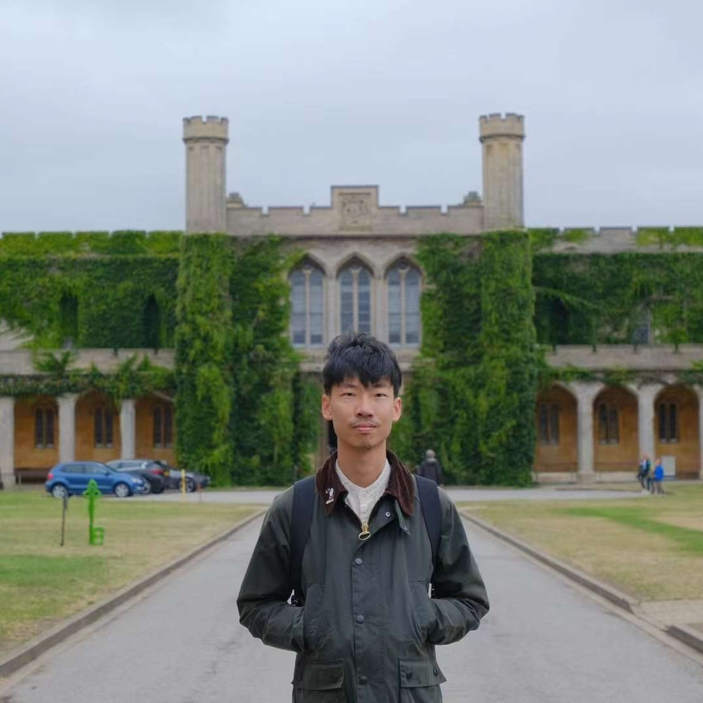
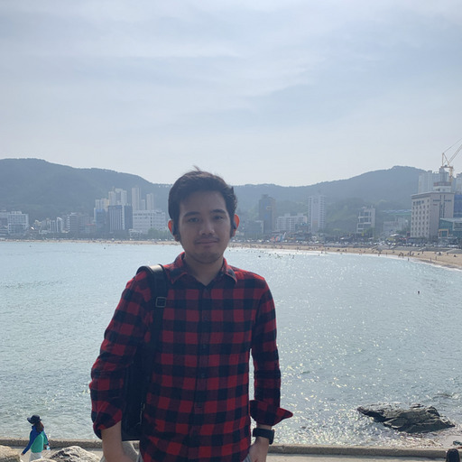
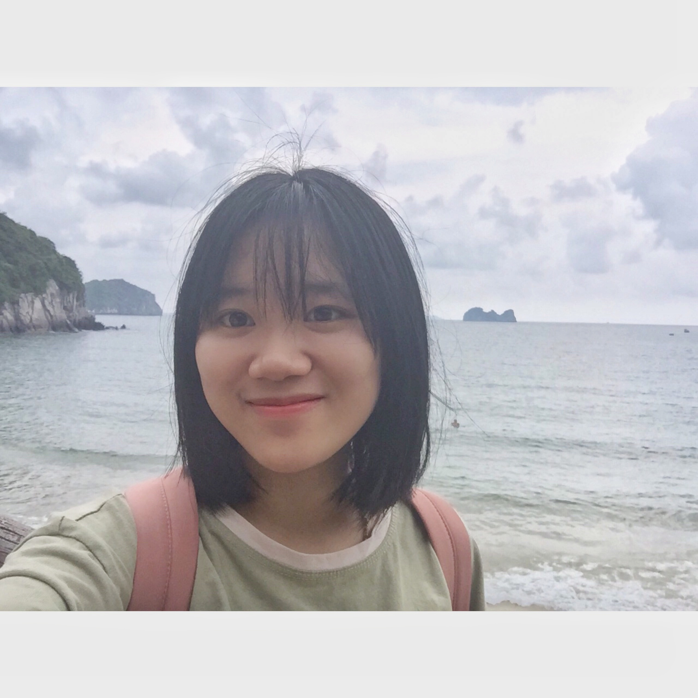
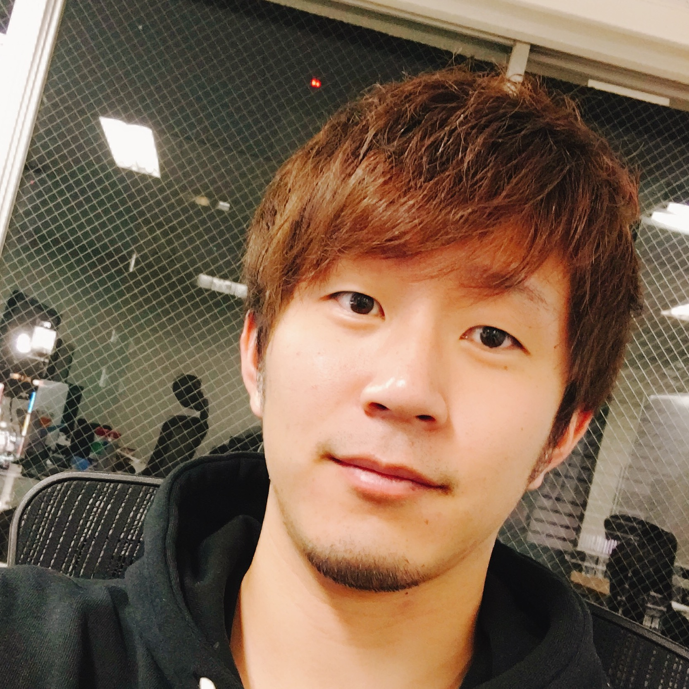

# Faculty/Staff

 

    

    

        

        

            <figure class="image is-48x48">
            
            </figure>
        

        

            
<a href="https://naoya-i.github.io/">Naoya Inoue</a>

            
Associate Professor (founder)

        

        

    

    

  

  

  

# Students

## PhD Students

I'm actively recruting highly motivated PhD students worldwide!
See [Join us](https://rebelsnlu-jaist.github.io/joinus.html) for further details.

## Masters Students

 

    

        

            

                

                    <figure class="image is-48x48">
                    
                    </figure>
                

                

                    
<a href="./">Bowen Gao</a>

                    
M1 (Apr.)

                

            

        

    

  

  

    

        

            

                

                    <figure class="image is-48x48">
                    
                    </figure>
                

                

                    
<a href="./">Shotaro Kitamura</a>

                    
M1 (Apr.)

                

            

        

    

  

  

    

        

            

                

                    <figure class="image is-48x48">
                    
                    </figure>
                

                

                    
<a href="./">Yuting Shi</a>

                    
M1 (Apr.)

                

            

        

    

  

  

    

        

            

                

                    <figure class="image is-48x48">
                    
                    </figure>
                

                

                    
<a href="./">Erika Yanagisawa</a>

                    
M1 (Apr.)

                

            

        

    

  

  

    

        

            

                

                    <figure class="image is-48x48">
                    
                    </figure>
                

                

                    
<a href="./">Irfan Robbani </a>

                    
M1 (Oct.)

                

            

        

    

  

  

    

        

            

                

                    <figure class="image is-48x48">
                    
                    </figure>
                

                

                    
<a href="./">Kenshiro Tanaka</a>

                    
M1 (Oct.)

                

            

        

    

  

 

 

 

    

        

            

                

                    <figure class="image is-48x48">
                    
                    </figure>
                

                

                    
<a href="./">Linh Hoai Luu</a>

                    
M2 (Oct. Joint Master Program with VNU)

                

            

        

    

  

  
  

  

## Masters Students (Tokyo Satelite)

 

    

        

            

                

                    <figure class="image is-48x48">
                    
                    </figure>
                

                

                    
<a href="./">Gaiki Ito</a>

                    
M1 (Apr.)

                

            

        

    

  

  
  

  

## Internship Students

## Alumni

 

    

        

            

                

                    <figure class="image is-48x48">
                    
                    </figure>
                

                

                    
<a href="./">Takumi Kuroda (8/1/2022-8/5/2022)</a>

                    
NIT, Tomakomai College (4th year)

                

            

        

    

  

  

    

        

            

                

                    <figure class="image is-48x48">
                    
                    </figure>
                

                

                    
<a href="./">Ce Zhang (8/17/2022-9/16/2022)</a>

                    
Hokuriku Univ. (B4)

                

            

        

    

  

