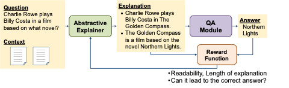
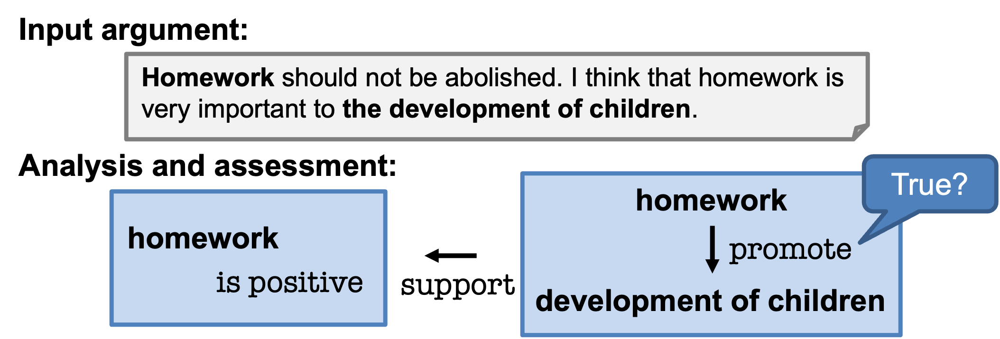

# Explainable Question Answering

Recent advances in Deep Learning have a large impact on NLP, resulting in more accurate NLP systems. However, for the systems to be more robust for unseen input texts, it is crucial for the systems to logically come up with an answer. Furthermore, when the systems are deployed in the real world, it is required for them to explain their own decision as well as answer given questions. In this project, we explore: How can we design such a computational model to do this? How can we train such a model with a machine learning algorithm? How do we imitate human reasoning?

Related papers: [Inoue et al. EMNLP2021](https://aclanthology.org/2021.emnlp-main.490/), [井之上2021](https://www.jstage.jst.go.jp/article/jnlp/29/1/29_237/_article/-char/ja/)

# Linguistic Resources for Natural Language Understanding

To objectively measure the progress of research, we need a quantitative evaluation measure indicating the quality of our models. Our research questions include: On what condition can we say the model has successfully read between the lines? How can we quantitatively measure it? Can we create such a benchmark dataset at scale?

Related papers: [Inoue et al. ACL2020](https://aclanthology.org/2020.acl-main.602/), [井之上2020](https://www.jstage.jst.go.jp/article/jnlp/27/3/27_665/_article/-char/ja)

# Argumentation Analysis and Assessment

When we write argumentative texts (e.g. essays), we usually leave background knowledge that we expect the reader to have implicit. For machines to fully understand such texts, it is crucial to auto-complete such background knowledge. We study the problem of analyzing argumentative texts as one important application of our technology. The research questions here include: How can we recognize a relationship between claims and premises? How can we assess argumentative texts and recognize their weaknesses? What part of the texts should be revised to strengthen the argument?

Related papers: [Singh et al. ArgMin2021](https://aclanthology.org/2021.argmining-1.6/), Mim et al. LREC2022, Singh et al. LREC2022, Naito et al. LREC2022, [谷口ら2021](https://www.amazon.co.jp/%E3%82%B3%E3%83%9F%E3%83%A5%E3%83%8B%E3%82%B1%E3%83%BC%E3%82%B7%E3%83%A7%E3%83%B3%E5%A0%B4%E3%81%AE%E3%83%A1%E3%82%AB%E3%83%8B%E3%82%BA%E3%83%A0%E3%83%87%E3%82%B6%E3%82%A4%E3%83%B3-%E8%B0%B7%E5%8F%A3-%E5%BF%A0%E5%A4%A7/dp/4766427734) (第7章)